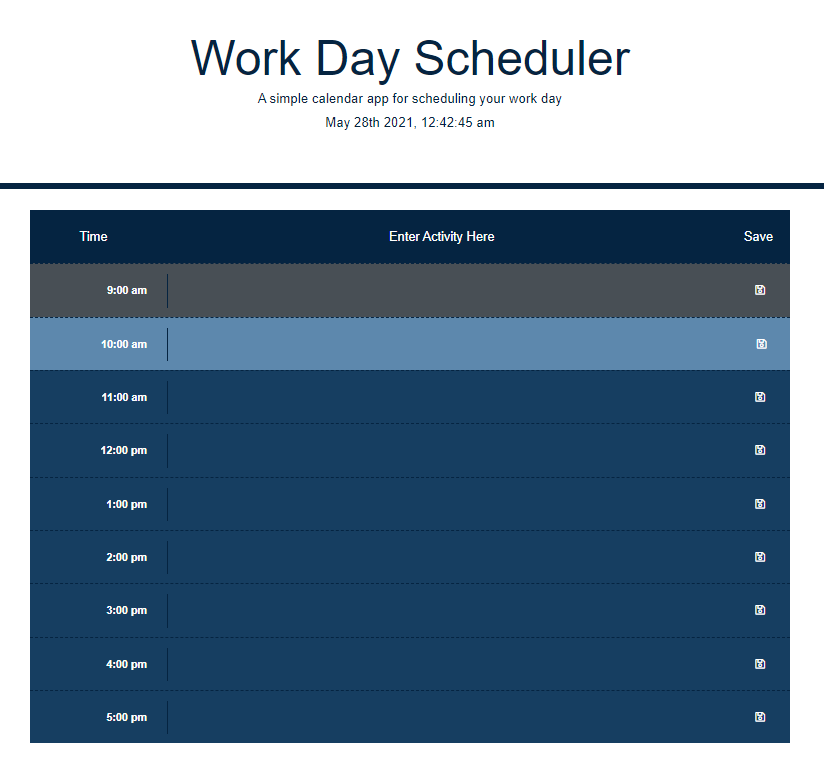

# Roatman_Work_Day_Scheduler

https://rmoatman.github.io/Roatman_Work_Day_Scheduler/

## Description
~~~
The intent of this project was to build a simple calendar application that allows a user to click on a time block to update and save events for the corresponding hour of a typical workday.  When saved, events are stored to local storage--which persists when the page is refreshed.

When the user opens the planner, the current day and time is displayed at the top of the calendar.  Each time block is color-coded to indicate whether it is in the past, present, or future.

The code runs in the browser and features dynamically updated HTML and CSS powered by jQuery.  The project also takes advantage of Bootstrap and Moment.js.

The core skills demonstrated in this project include:
    -   using Bootstrap to assist in styling 
    -   using jQuery to identify and manage classes and ids
    -   using Moment.js to get and update the current date and time
    -   using setInterval to automate and loop javascript
~~~

## Application and Reflection
~~~
Throughout this project, I made extensive use of Google's Developer tools.  I used the Console tab to monitor the progress of the code and the results of actions such as click and refresh.  I also used the Console tab to monitor what was occurring during the set intervals and during the change from one hour to the next.

I also used console.log whenever code did not work as expected.  I inserted many console.log checkpoints along the way and often found that my code wasn't working because the JavaScript had encountered a problem with earlier executed code.

The Elements tab was especially helpful when reviewing the class and id changes that were made when one hour changed to the next and elements were designated with the classes past, present, and future.  I was using the elements tab when I discovered that I needed to remove the past, present, and future classes when assigning a new class at the change of the hour.

Finally, I used the Application tab to monitor what information was being stored and when.  By observing this process I discovered that trying to load local storage when nothing existed caused an error.  Consequently, I inserted the checkforLocalData function right after getting the date and time for the header.  

I also realized that the data for all the hours was being saved if any save button was pressed.  I think this makes sense, however, I inferred from the Acceptance Criteria that save should only save that hour's event.  As a result, I deleted the original function which stored the events to local storage and added a switch to the $("button").click.  Now, not only does the script listen for a "save", it identifies which save button was clicked and only saves that hour's event.

As mentioned above, I did not initially realize that I had to remove past, present, and future classes when adding another at the hour's change.  Creating the process which changes the color of each row according to the time took the most time of any other challenge in this project.  The resulting comparetest function runs when the page opens or refreshes.  It also runs every 60 seconds.

I had to research how to make the function run at that interval; figure out how to represent the current hour in a way that could be used in a conditional statement; and determine how to compare each row to the current hour. (I solved this by creating a variable with an array of objects.  Each object represents one hour and includes the military time equivalent as one of its values.)

The comparetest function is lengthy and repetitive.  I am sure there are more efficient ways to perform the comparetest process (and other functions within the code).  When I learn them, I will revisit this code.  I expect that I will eventually no longer need the variable with an array of objects (instead, I will only have to save key/value pairs in local storage) and that additional jQuery will streamline code.

I enjoyed this challenge.  But, the best part of this project was the two sessions I spent with other coders (one who is enrolled in the BootCamp and one who is not) discussing, brainstorming, reviewing, and troubleshooting code.  
~~~

## Contact Information
~~~
- Raemarie Oatman
- raemarie.oatman@gmail.com
- https://www.linkedin.com/in/raemarieoatman
- https://github.com/rmoatman
~~~
# Roatman_Work-Day_Scheduler